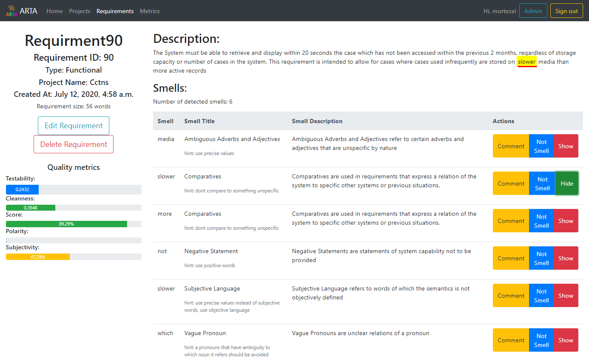
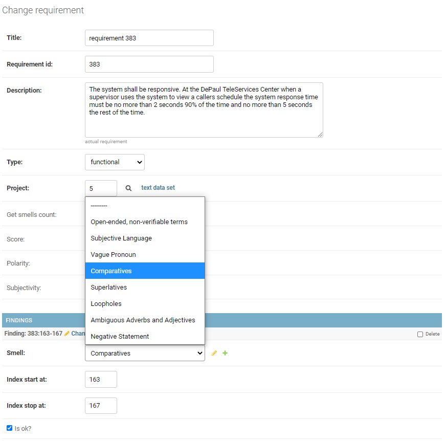
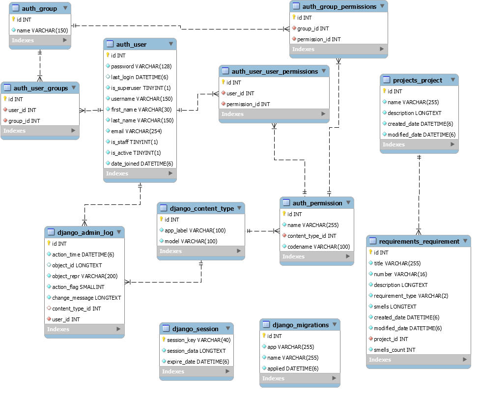

# ARTA: Automatic Requirement Testability Analyzer

**Morteza Zakeri**†

† Ph.D. Student, Iran University of Science and Technology, Tehran, Iran (m-zakeri@live.com).

Version 0.1.2 (20, March 2021) ├ Download [PDF] version

**Abstract—** Software testability is the propensity of software artifact to reveal its existing defects. Software requirements are crucial artifacts in developing software. Requirements specifications are used in both the functional and acceptance testing to ensure that a program meets its requirements. 
A testable requirement increases the effectiveness of testing while decreasing the cost and time.
In this project, we define requirement testability in terms of requirements smells and propose a measuring method to compute requirement testability. 
  
**Index Terms:** Software requirement, requirement testability, requirement smells, expert system

## 1 Introduction

The achievement of the quality of software requirements is the first step towards software quality. Natural language is the main representation means of industrial requirements documents, which implies that requirements documents are inherently ambiguous. A Requirements Smell is an indicator of a  quality violation, which may lead to a defect, with a concrete location and a concrete detection mechanism.

Unfortunately, there is no publicly available tool and benchmark to detect requirement smells and measure the requirements quality. ARTA is a research project at [IUST Reverse Engineering Laboratory](http://reverse.iust.ac.ir/) aimed at detecting requirement smells and measuring requirement testability in all kinds of requirements expressed in natural languages.

## 2 Tool support
ARTA is a web-based software requirement analysis tool using the state-of-the-art natural language processing (NLP) and statistical machine learning techniques to analyze the software requirement.  
An online demo of ARAT is available on 
[http://arta.iust-parsa.ir/](http://arta.iust-parsa.ir/).
You can log-in with following credential:

 * Demo username: User
 * Demo password: arta@IUST

and watch the examples requirements.  

### 2.1 Requirement analyzer

Requirement analyzer detects smelly words in each requirement, recognize their type, and provides a list of smelly words. The web interface also highlights smelly words in the requirement text.

Figure 1 shows ARTA requirement smell analyzer and detector. 

*Figure 1: Requirement smell detector in ARTA*

### 2.2. Requirement smell labeling module

ARAT web interface also provides an ability to label each requirement with corresponding smells. Figure 2 shows ARTA requirement labeling module.

*Figure 2: Requirement smell labeling in ARTA*

### 2.3 Data model

Figure 3 shows ARTA database ERD model. All projects and their requirements are kept in a MySQL database.

*Figure 3: ARTA data model*

## 3 Release date

The full version of source code will be available as soon as the relevant paper(s) are published.

## 4 FAQ
For any question please contact `m-zakeri@live.com`

